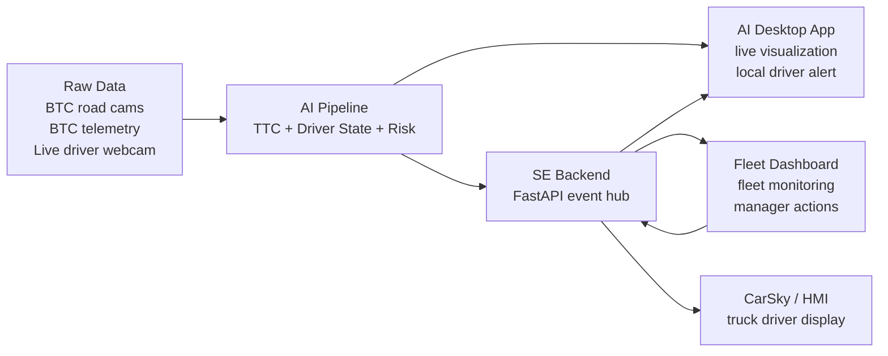

# End-to-End Data Flow

## Main flow



## What each part receives

```text
Raw Data
  → camera frames + telemetry

AI Pipeline
  → predicted_ttc
  → predicted_driver_state
  → predicted_risk_score
  → selected decision alerts

AI Desktop App
  → road/cabin visualization
  → local warning from AI
  → manager intervention message from Fleet Dashboard

SE Backend
  → AI alert/event JSON
  → current trip snapshot
  → saved trip history during demo

Fleet Dashboard
  → live trip status
  → risk/driver/TTC insights
  → intervention buttons

CarSky / HMI
  → warning/critical driver display
```

## Two demo modes

```text
1. hybrid-live
   BTC road cam + BTC telemetry + live webcam driver cam

2. dataset-fleet
   all BTC trips in one dataset folder replayed as fleet trips
```

## One-line command shape

```powershell
.\scripts\run_product_demo.ps1 `
  -Mode <hybrid-live | dataset-fleet> `
  -DriverModel AI\models\candidate_013.joblib `
  -OpenDashboard
```

## Golden rule

```text
AI creates the safety values.
SE transports and stores them.
Dashboard and CarSky only display/act on them.
```
