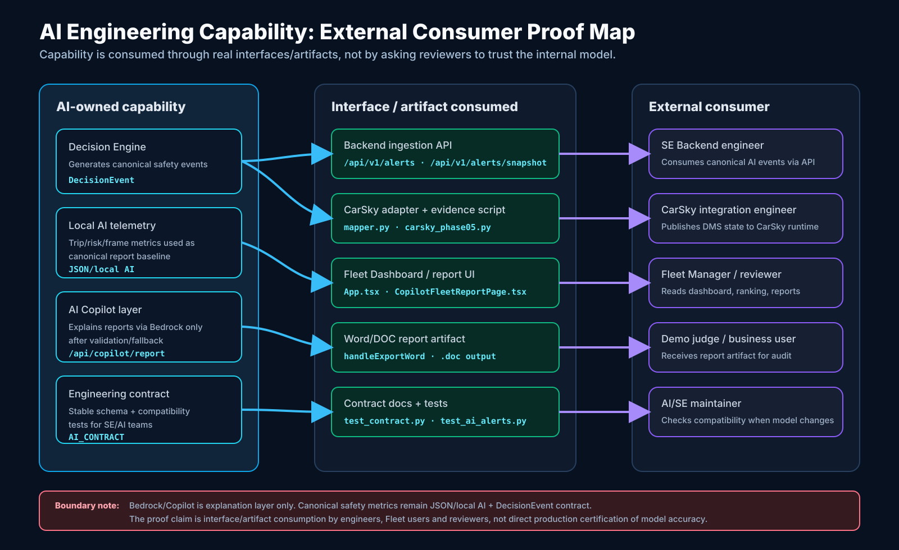

# 6. Platform Utilization / Ecosystem Alignment

File này là bản copy-ready cho mục **6. Platform utilization / ecosystem alignment**. Nội dung tập trung vào hai phần đội đang có thật trong dự án:

- `CarSky / Connected-Car / Android HMI`
- `AI Engineering capability` qua contract, API, report artifact và workflow cho kỹ sư / người dùng bên ngoài AI core

Không claim custom VSS / custom CarProperty là production-ready. Demo hiện tại dùng đường đã verify được hơn: `Vehicle.Speed` speed-mux -> `PERF_VEHICLE_SPEED` -> Android `CarPropertyManager`.

---

## Bản Ngắn Để Dán Vào Báo Cáo

FPTU DMS Vision không chỉ dùng CarSky như một nơi host UI. Nhóm dùng CarSky làm connected-car runtime để chứng minh luồng AI safety event đi qua signal ecosystem thật: Backend publish DMS state vào CarSky Signal API, `DMS Signal Broker` giữ signal state theo KUKSA, `DMS HMI Bridge` chạy trong CarSky Script Node để forward signal sang VHAL, và `DMS Android HMI` chạy trên Skycraft/AAOS để đọc `CarPropertyManager` và hiển thị trạng thái cho tài xế.

Do runtime AAOS hiện expose ổn định property chuẩn `PERF_VEHICLE_SPEED`, bản demo dùng `Vehicle.Speed` speed-mux làm transport đã kiểm chứng. Các giá trị như risk score, severity, driver state, alertness, TTC, recommended action, speed và safe score được encode thành nhóm `41.xxx` đến `50.xxx`, sau đó APK decode lại thành trạng thái HMI. Đây là demo workaround có chủ đích, không phải claim rằng custom DMS VSS paths đã production-ready.

Về AI Engineering, nhóm có boundary rõ giữa AI core và SE: AI tạo `DecisionEvent` / local telemetry contract, Backend nhận và phân phối qua API/WebSocket/CarSky adapter, Fleet Dashboard và AI Copilot Report tiêu thụ qua interface ổn định. External consumer không gọi trực tiếp model nội bộ; họ dùng các artifact/interface như `/api/v1/alerts`, `/api/copilot/report`, Word/DOC report, evidence script và AI contract docs để audit, demo và tích hợp tiếp.

---

## 1. CarSky Mapping: Component Chạy Ở Đâu Và Giao Tiếp Bằng Gì?

| Boundary | Component / workload team-owned | Node / service chạy | Interface / mechanism | Status đúng nên claim |
|---|---|---|---|---|
| AI / Decision Engine -> Backend | `DecisionEvent` / live telemetry contract | AI pipeline + Backend API boundary | HTTP/API nội bộ, canonical event payload | Implemented source-level |
| Backend -> CarSky | CarSky mapper/client/publisher | Backend service (`SE/BE`) | CarSky REST Signal API, publish signal payload | Implemented, runtime script available |
| CarSky signal runtime | `DMS Signal Broker` | CarSky `KUKSA Broker` node | KUKSA / Signal Watch state | Verified by deployment when node is running |
| Signal Broker -> HMI Bridge | `DMS HMI Bridge` | CarSky `Script Node` | Subscribe `Vehicle.Speed`, push VHAL property | Implemented by Lua bridge |
| HMI Bridge -> Android VHAL | VHAL forwarding layer | CarSky bridge pin -> Android vhal pin | `PERF_VEHICLE_SPEED` (`0x11600207`) | Implemented for demo with speed-mux |
| Android VHAL -> Driver HMI | `DMS Android HMI` APK | CarSky `Skycraft` / AAOS node | Android `CarPropertyManager` callback + polling fallback | APK artifact verified; runtime proof needs same-event video |
| Backend/Fleet -> User report | Fleet Dashboard + Copilot Report | Frontend/Backend web app | `/api/copilot`, `/api/copilot/report`, Word/DOC export | Implemented, not a CarSky node |

Evidence locator:

```text
SE/BE/app/integrations/carsky/mapper.py
SE/BE/app/integrations/carsky/client.py
SE/BE/app/integrations/carsky/service.py
SE/BE/scripts/carsky_phase05.py
SE/BE/carsky/dms_hmi_bridge_speed_passthrough.lua
SE/HMI/app/src/main/java/vn/fpt/dms/hmi/MainActivity.java
SE/HMI/release/dms-hmi-realtime-vhal.apk
```

---

## 2. CarSky Capability Nào Được Tái Sử Dụng?

| CarSky capability | Nhóm dùng như thế nào | Vì sao đây là ecosystem alignment |
|---|---|---|
| Blueprint / node orchestration | Tổ chức 3 node: `DMS Signal Broker`, `DMS HMI Bridge`, `DMS Android HMI` | Không tự dựng runtime ngoài; dùng topology của CarSky để chứng minh flow |
| KUKSA Broker | Là signal state layer cho `Vehicle.Speed` | Tái sử dụng vehicle signal broker thay vì tự dựng message bus riêng |
| Signal Watch | Quan sát `Vehicle.Speed` đổi khi Backend publish | Dùng tool debug/observability của CarSky để làm runtime evidence |
| Script Node | Chạy bridge Lua từ KUKSA sang VHAL | Tái sử dụng compute node trong blueprint thay vì hardcode trong APK |
| Skycraft / Android Automotive node | Chạy Driver HMI APK | Dùng AAOS/HMI node để thể hiện driver-facing connected-car UI |
| VHAL / CarProperty path | APK đọc `PERF_VEHICLE_SPEED` qua `CarPropertyManager` | Bám vào Android Automotive vehicle property mechanism |
| REST Signal API | Backend publish signal vào CarSky | Tích hợp qua API contract của platform thay vì gọi trực tiếp APK |

Claim nên dùng:

```text
Nhóm tái sử dụng CarSky blueprint, KUKSA Signal Broker, Script Node, Signal Watch, Skycraft Android node và VHAL/CarProperty route. Nhóm không tự dựng signal broker, không tự dựng AAOS runtime và không dùng web dashboard làm bằng chứng thay thế cho connected-car path.
```

---

## 3. Core Flow End-To-End Trên Blueprint

Luồng platform evidence đúng:

```text
AI / DecisionEvent
  -> Backend /api/v1/alerts hoặc live snapshot
  -> CarSky mapper/client/publisher
  -> CarSky REST Signal API
  -> DMS Signal Broker / KUKSA
  -> Vehicle.Speed speed-mux
  -> DMS HMI Bridge Script Node
  -> VHAL PERF_VEHICLE_SPEED
  -> Android CarPropertyManager
  -> DMS Android HMI APK UI/logcat
```

Speed-mux groups đang dùng:

| Group | Ý nghĩa |
|---|---|
| `41.xxx` | Risk score |
| `42.xxx` | Severity: SAFE / WARNING / CRITICAL / RECOVERY |
| `43.xxx` | Driver state |
| `44.xxx` | Alertness score |
| `45.xxx` | TTC |
| `46.xxx` | Critical alert flag |
| `47.xxx` | AI status |
| `48.xxx` | Recommended action |
| `49.xxx` | Real speed km/h |
| `50.xxx` | Safe score |

Runtime evidence đã từng quan sát trong terminal của nhóm:

```json
{
  "ok": true,
  "mode": "vehicle-speed-mux",
  "sent": 14
}
```

`fallback_reason` có thể xuất hiện nếu CarSky trả `Unknown signal path: Vehicle.Driver.State`. Đây không phải lỗi demo cuối; nó chứng minh custom VSS path không có trong deployment hiện tại, sau đó script fallback sang `Vehicle.Speed` speed-mux.

---

## 4. AI Engineering: External Consumer Sử Dụng Capability Qua Interface / Artifact Nào?

Solution chính là Driver Monitoring / Fleet Safety, nhưng dự án có phần AI Engineering rõ ràng: AI output không bị nhúng trực tiếp vào UI một cách tùy ý, mà được đóng gói thành contract, API, report và script để các bên ngoài AI core tiêu thụ.

Rubric yêu cầu chứng minh: **capability được external consumer sử dụng thực tế qua interface hoặc artifact**. Với dự án này, external consumer không phải chỉ là “người dùng cuối”; nó gồm cả SE engineer, CarSky integration engineer, Fleet Manager, demo reviewer và AI/SE maintainer. Những nhóm này consume AI capability qua API, contract, report artifact, tests và evidence scripts.

Evidence package đã collect từ source/test/artifact thật:

```text
evidence/platform_ai_engineering/README_PLATFORM_AI_ENGINEERING_EVIDENCE.md
evidence/platform_ai_engineering/platform_ai_engineering_evidence.html
evidence/platform_ai_engineering/raw/
```

Kết quả kiểm chứng hiện tại:

```text
SE/BE pytest: 17 passed
Covered tests: test_contract.py, test_ai_alerts.py, test_carsky.py
APK artifact: SE/HMI/release/dms-hmi-realtime-vhal.apk
APK SHA256: 51a44e1570551c16abc83db7fa9f167f3ae40a62cd1b57bde5dc465adb91cbb0
```



| External consumer | Capability họ dùng | Interface / artifact | Evidence locator | Evidence image / log |
|---|---|---|---|---|
| SE Backend engineer | Nhận output AI theo contract | `DecisionEvent`, `/api/v1/alerts`, `/api/v1/alerts/snapshot` | `SE/BE/app/modules/ai_alerts/router.py`, `SE/BE/tests/test_ai_alerts.py` | `evidence/platform_ai_engineering/screenshots/01_backend_consumer_api_evidence.png` |
| CarSky integration engineer | Publish AI safety state sang CarSky | CarSky mapper/client/service, `carsky_phase05.py` | `SE/BE/app/integrations/carsky/*`, `SE/BE/tests/test_carsky.py` | `evidence/platform_ai_engineering/screenshots/02_carsky_consumer_mapper_evidence.png`; runtime CarSky screenshot `Vehicle.Speed` + `DMS_HMI_SPEED_MUX` |
| Fleet Manager / demo reviewer | Xem trip, ranking, insights, reports | Fleet Dashboard UI + Word/DOC report | `SE/FE/src/App.tsx`, `SE/FE/src/components/CopilotFleetReportPage.tsx` | Fleet Dashboard video/screenshot; `evidence/platform_ai_engineering/screenshots/03_copilot_report_export_evidence.png` |
| AI Copilot user | Yêu cầu safety/maintenance report | `/api/copilot`, `/api/copilot/report` | `SE/FE/server.ts`, `SE/FE/docs/AI_COPILOT_FUNCTION_CALLING_REPORTS.md` | `evidence/platform_ai_engineering/screenshots/03_copilot_report_export_evidence.png` |
| AI/SE engineer | Kiểm tra compatibility khi model output đổi | AI contract + tests | `SE/BE/docs/AI_CONTRACT_AND_CHANGELOG.md`, `SE/BE/tests/test_contract.py` | `evidence/platform_ai_engineering/screenshots/04_tests_apk_artifact_evidence.png` |
| Demo operator / judge | Reproduce evidence flow | Evidence runbook + shell script | `README_RUN_OUTPUT_007_CARSKY_HMI_EVIDENCE.md`, `scripts/show_output_007_carsky_hmi_evidence.sh` | `evidence/platform_ai_engineering/README_PLATFORM_AI_ENGINEERING_EVIDENCE.md`; `evidence/platform_ai_engineering/raw/` |

### 4.1 External Consumer Proof Matrix

| Consumer | Họ bấm/chạy/đọc gì? | Capability AI được consume là gì? | Evidence | Evidence image / log |
|---|---|---|---|---|
| `SE Backend engineer` | Gửi hoặc nhận payload qua `/api/v1/alerts` và `/api/v1/alerts/snapshot` | Canonical AI safety event được đưa qua Backend boundary | `SE/BE/app/modules/ai_alerts/router.py` có `DecisionEventPayload`; `SE/BE/tests/test_ai_alerts.py` test alert ingestion và CarSky forwarding | `evidence/platform_ai_engineering/screenshots/01_backend_consumer_api_evidence.png` |
| `CarSky integration engineer` | Chạy `.venv/bin/python scripts/carsky_phase05.py scenario critical` | AI/DMS state được map sang CarSky signal transport | `SE/BE/scripts/carsky_phase05.py`; `SE/BE/app/integrations/carsky/mapper.py`; runtime trả `ok=true`, `mode=vehicle-speed-mux`, `sent=14` khi CarSky token/deployment đúng | `evidence/platform_ai_engineering/screenshots/02_carsky_consumer_mapper_evidence.png`; CarSky runtime screenshot có `Vehicle.Speed=49.xxx` và `DMS_HMI_SPEED_MUX` |
| `Fleet Manager` | Mở Fleet Dashboard, trip detail, ranking, performance insights | JSON/local AI metrics trở thành operational view | `SE/FE/src/App.tsx`, `SE/FE/src/components/TripDetailView.tsx`, `SE/FE/src/components/VehicleLiveView.tsx` | Fleet Dashboard video/screenshot: saved trips -> insight -> ranking -> report |
| `AI Copilot report user` | Mở safety/maintenance report hoặc bấm export DOC | AI explanation layer được consume qua report UI + Word/DOC artifact | `SE/FE/server.ts` có `/api/copilot/report`; `CopilotFleetReportPage.tsx` có `handleExportWord` | `evidence/platform_ai_engineering/screenshots/03_copilot_report_export_evidence.png` |
| `AI/SE maintainer` | Chạy contract tests khi model output thay đổi | Compatibility contract bảo vệ downstream consumers | `SE/BE/docs/AI_CONTRACT_AND_CHANGELOG.md`; `SE/BE/tests/test_contract.py` | `evidence/platform_ai_engineering/screenshots/04_tests_apk_artifact_evidence.png` |
| `Judge / reviewer` | Chạy evidence script hoặc xem video evidence | Capability được reproduce bằng artifact/script, không cần truy cập model nội bộ | `README_RUN_OUTPUT_007_CARSKY_HMI_EVIDENCE.md`; `scripts/show_output_007_carsky_hmi_evidence.sh` | `evidence/platform_ai_engineering/README_PLATFORM_AI_ENGINEERING_EVIDENCE.md`; raw logs in `evidence/platform_ai_engineering/raw/` |

### 4.2 AI Engineering Evidence Flow

```text
AI model / local AI pipeline
  -> canonical DecisionEvent / telemetry JSON
  -> Backend API boundary
     - /api/v1/alerts
     - /api/v1/alerts/snapshot
  -> downstream consumers
     - Fleet Dashboard
     - CarSky publisher
     - AI Copilot Report
     - Word/DOC export
     - tests / evidence scripts
```

Điểm cần nhấn mạnh khi trình bày:

```text
External consumer không consume model raw. Họ consume output AI qua boundary đã định nghĩa: API, contract, report artifact và evidence script. Điều này làm AI capability có thể tích hợp, kiểm thử và audit được.
```

### 4.3 Command Để Quay Evidence Cho Phần AI Engineering

Nhanh nhất là chạy script collect evidence đã tạo sẵn:

```bash
cd /Users/lilnhan/Documents/GitHub/Hackathon-Automotive-2026/HACKATHON
scripts/collect_platform_ai_engineering_evidence.sh
open evidence/platform_ai_engineering/platform_ai_engineering_evidence.html
```

Khi HTML mở lên, quay/chụp các phần:

```text
DecisionEvent schema
Backend /api/v1/alerts boundary
CarSky mapper vehicle-speed-mux
Copilot /api/copilot/report
Word/DOC export
Pytest result 17 passed
APK hash/runtime strings
```

Chạy từ root repo:

```bash
cd /Users/lilnhan/Documents/GitHub/Hackathon-Automotive-2026/HACKATHON
```

Show AI contract + Backend consumer boundary:

```bash
grep -RInE "DecisionEventPayload|/api/v1/alerts|/api/v1/alerts/snapshot|CarSkySignalMapper" SE/BE/app SE/BE/tests
```

Show Copilot report API + Word/DOC artifact:

```bash
grep -RInE "/api/copilot/report|AWS_BEARER_TOKEN_BEDROCK|validated|pending|unavailable|handleExportWord|\\.doc" SE/FE/server.ts SE/FE/src/components/CopilotFleetReportPage.tsx
```

Show CarSky external integration script:

```bash
grep -RInE "scenario critical|vehicle-speed-mux|Vehicle.Speed|sent" SE/BE/scripts/carsky_phase05.py SE/BE/app/integrations/carsky
```

Show contract tests:

```bash
cd SE/BE
.venv/bin/python -m pytest tests/test_contract.py tests/test_ai_alerts.py tests/test_carsky.py
```

Video timestamp gợi ý:

```text
00:00 - 00:20 AI contract và Backend API boundary
00:20 - 00:45 Copilot report API + validated/pending/unavailable fallback
00:45 - 01:10 Word/DOC report artifact
01:10 - 01:40 CarSky integration consumes same AI/DMS state
01:40 - 02:10 Contract tests chứng minh interface không chỉ là tài liệu
```

Copy-ready claim:

```text
AI Engineering capability của đội được tiêu thụ qua interface/artifact thật, không chỉ nằm trong model nội bộ. SE Backend engineer consume `DecisionEvent` qua `/api/v1/alerts`; CarSky integration engineer consume cùng DMS state qua CarSky mapper và `carsky_phase05.py`; Fleet Manager consume JSON/local AI metrics qua Fleet Dashboard; AI Copilot report user consume Bedrock explanation qua `/api/copilot/report` và Word/DOC export; reviewer consume capability qua evidence script và contract tests. Các interface/artifact này có source và test evidence trong repo, nên có thể audit và reproduce mà không cần truy cập trực tiếp model raw.
```

---

## 5. Phần Nào Là Real, Phần Nào Là Workaround, Phần Nào Không Claim?

| Phần | Claim đúng |
|---|---|
| Backend -> CarSky REST Signal API | Real / implemented |
| `DMS Signal Broker` / KUKSA | Real when deployment is running |
| Signal Watch thấy `Vehicle.Speed` | Runtime evidence cho signal state |
| `DMS HMI Bridge` Lua Script Node | Real / implemented |
| Bridge forward `Vehicle.Speed -> PERF_VEHICLE_SPEED` | Real demo path |
| Android HMI APK artifact | Real artifact, hash/DEX/signing evidence available |
| Android UI đổi cùng event | Chỉ claim khi có same-event video: Signal Watch + bridge log + logcat + UI |
| Custom DMS VSS paths | Explored / not final demo claim |
| Custom DMS CarProperty IDs | Không claim production-ready trong current AAOS runtime |
| `Vehicle.Speed` speed-mux | Verified demo workaround, not semantic production design |
| Fleet Dashboard web hosting | Product UI evidence, không thay thế CarSky evidence |
| Bedrock / AI Copilot | Explanation layer, không phải nguồn canonical safety metrics |
| PDF export | Không nằm trong final claim; final claim là Word/DOC export |

---

## 6. Evidence Nên Quay Để Ăn Điểm Platform Utilization

Quay ngắn, chỉ cần chứng minh chain thật:

```text
00:00 - 00:20 CarSky blueprint có 3 node running:
DMS Signal Broker, DMS HMI Bridge, DMS Android HMI.

00:20 - 00:40 Mở Signal Watch, watch Vehicle.Speed.

00:40 - 01:00 Chạy backend script:
cd SE/BE
.venv/bin/python scripts/carsky_phase05.py scenario critical

01:00 - 01:25 Signal Watch thấy Vehicle.Speed đổi sang nhóm 41.xxx-50.xxx.

01:25 - 01:50 Mở Logs: DMS HMI Bridge, thấy log DMS_HMI_SPEED_MUX hoặc DMS_HMI_MUX forward sang PERF_VEHICLE_SPEED.

01:50 - 02:20 Mở Android HMI / logcat, thấy DMS_HMI nhận mux và UI đổi severity/risk/action.

02:20 - 02:40 Chạy reset:
.venv/bin/python scripts/carsky_phase05.py scenario normal
```

Nếu chưa quay được Android UI cùng event, dùng caveat:

```text
Video hiện chứng minh Backend -> CarSky Signal Watch -> HMI Bridge. Android APK artifact và CarPropertyManager path đã có source/artifact evidence, nhưng same-event Android UI capture cần quay riêng khi CarSky runtime ổn định.
```

---

## 7. Lệnh Evidence Có Thể Chạy Khi Quay

Backend mapper:

```bash
cd /Users/lilnhan/Documents/GitHub/Hackathon-Automotive-2026/HACKATHON
grep -RInE "vehicle-speed-mux|Vehicle.Speed" SE/BE/app/integrations/carsky SE/BE/scripts/carsky_phase05.py
```

Bridge:

```bash
grep -RInE "PERF_VEHICLE_SPEED|Vehicle.Speed|DMS_HMI" SE/BE/carsky
```

APK artifact:

```bash
ls -lh SE/HMI/release/dms-hmi-realtime-vhal.apk
shasum -a 256 SE/HMI/release/dms-hmi-realtime-vhal.apk
unzip -p SE/HMI/release/dms-hmi-realtime-vhal.apk classes.dex | strings | grep -E "DMS_HMI|PERF_VEHICLE_SPEED|CarPropertyManager|SAFE|CRITICAL|TTC|km/h"
```

CarSky runtime:

```bash
cd SE/BE
.venv/bin/python scripts/carsky_phase05.py status
.venv/bin/python scripts/carsky_phase05.py nodes
.venv/bin/python scripts/carsky_phase05.py scenario critical
.venv/bin/python scripts/carsky_phase05.py scenario normal
```

AI Engineering contract/API:

```bash
grep -RInE "DecisionEvent|/api/v1/alerts|/api/copilot/report|AWS_BEARER_TOKEN_BEDROCK|handleExportWord" AI SE/BE SE/FE README_AI_COPILOT_CONTEXT.md README_AI_FALLBACK_LAYERS.md
```

Tests nên chạy nếu cần source-level proof:

```bash
cd SE/BE
.venv/bin/python -m pytest tests/test_carsky.py tests/test_ai_alerts.py tests/test_contract.py
```

---

## 8. Câu Trả Lời Full Cho Mục `[ĐỘI ĐIỀN TẠI ĐÂY]`

```markdown
FPTU DMS Vision có platform utilization theo hai lớp: CarSky connected-car runtime và AI Engineering interface/artifact.

Ở lớp CarSky, đội không chỉ host một UI ngoài xe. Backend publish DMS safety state vào CarSky qua REST Signal API. Signal được giữ trong `DMS Signal Broker` / KUKSA node, sau đó `DMS HMI Bridge` chạy bằng Script Node subscribe `Vehicle.Speed` và forward sang Android VHAL qua `PERF_VEHICLE_SPEED`. `DMS Android HMI` chạy trên Skycraft/AAOS node, đọc Android `CarPropertyManager` và render risk, severity, driver state, alertness, TTC, recommended action, speed và safe score cho tài xế.

Do deployment AAOS hiện expose ổn định `PERF_VEHICLE_SPEED` hơn các custom DMS CarProperty, demo dùng `Vehicle.Speed` speed-mux làm transport. Các nhóm giá trị `41.xxx` đến `50.xxx` encode DMS state, APK decode lại thành UI state. Đây là workaround đã kiểm chứng cho demo, không claim custom DMS VSS / custom CarProperty là production-ready.

Các capability CarSky được tái sử dụng gồm Blueprint/node orchestration, KUKSA Signal Broker, Signal Watch, Script Node, Skycraft Android node và VHAL/CarProperty path. Nhóm không tự dựng signal broker, không tự dựng AAOS runtime, và không dùng web dashboard làm bằng chứng thay thế cho connected-car flow.

Core flow evidence cần thể hiện trên blueprint là:
AI/DecisionEvent -> Backend -> CarSky REST Signal API -> DMS Signal Broker/KUKSA -> Vehicle.Speed speed-mux -> DMS HMI Bridge -> VHAL PERF_VEHICLE_SPEED -> Android CarPropertyManager -> DMS Android HMI.

Ở lớp AI Engineering, output AI được đóng gói thành contract và interface để bên ngoài AI core tiêu thụ. SE engineer consume `DecisionEvent` qua Backend API `/api/v1/alerts`; CarSky integration consume qua mapper/client/publisher; Fleet Manager consume qua Fleet Dashboard và AI Copilot Report; reviewer consume qua Word/DOC report và evidence scripts. Các artifact chính gồm `SE/BE/docs/AI_CONTRACT_AND_CHANGELOG.md`, `SE/BE/tests/test_contract.py`, `SE/BE/tests/test_ai_alerts.py`, `SE/BE/tests/test_carsky.py`, `SE/FE/server.ts`, `SE/FE/src/components/CopilotFleetReportPage.tsx`, `SE/BE/scripts/carsky_phase05.py` và `README_RUN_OUTPUT_007_CARSKY_HMI_EVIDENCE.md`.

Giới hạn cần nói rõ: `Vehicle.Speed` speed-mux là demo transport phù hợp với runtime hiện tại, không phải semantic production design. Bedrock / AI Copilot là explanation layer, không phải nguồn canonical safety metrics. Nếu chưa có video cùng một event từ Signal Watch -> Bridge log -> Android logcat -> APK UI, chỉ nên claim source/artifact verified và runtime chain partially captured.
```

---

## 9. Suggested Evidence Locator Trong Report

```text
SE/BE/app/integrations/carsky/mapper.py
SE/BE/app/integrations/carsky/client.py
SE/BE/app/integrations/carsky/service.py
SE/BE/scripts/carsky_phase05.py
SE/BE/carsky/dms_hmi_bridge_speed_passthrough.lua
SE/HMI/app/src/main/java/vn/fpt/dms/hmi/MainActivity.java
SE/HMI/release/dms-hmi-realtime-vhal.apk
SE/BE/docs/AI_CONTRACT_AND_CHANGELOG.md
AI/core/decision_engine/README.md
SE/FE/docs/AI_COPILOT_FUNCTION_CALLING_REPORTS.md
README_AI_FALLBACK_LAYERS.md
README_RUN_OUTPUT_007_CARSKY_HMI_EVIDENCE.md
```

---

## 10. Kết Luận Nên Nói Trước Ban Giám Khảo

```text
Điểm mạnh của platform alignment là nhóm có luồng thật qua CarSky runtime chứ không chỉ demo web. Điểm trung thực là nhóm nói rõ current workaround: custom VSS path chưa ổn định trong deployment nên final demo dùng Vehicle.Speed speed-mux qua PERF_VEHICLE_SPEED. Điểm AI Engineering là output AI được biến thành contract/API/report/script để kỹ sư và người dùng ngoài AI core tiêu thụ, kiểm thử và audit được.
```
