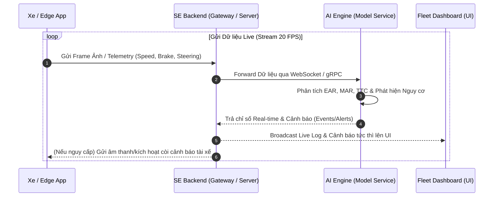

# Kiến trúc Trao đổi Live giữa AI & SE và Mô hình Quản lý Trip / Fleet

> **Tài liệu làm rõ cơ chế tương tác thời gian thực (Live Stream) giữa AI Engine & Hệ thống SE (Software Engineering), cùng mô hình quản lý đơn xe (Single-Trip) và đa xe (Multi-Trip / Fleet Management).**

---

## 1. Tổng quan Luồng Giao tiếp Live (Real-time Communication)

Hệ thống giám sát hành trình & an toàn tài xế (DMS - Driver Monitoring System) đòi hỏi việc tương tác **thời gian thực** giữa hai thành phần:

* **SE (Software Engineering / Backend & Frontend System):** Chịu trách nhiệm quản lý kết nối, luồng dữ liệu (Data Pipeline), lưu trữ log, hiển thị giao diện UI Dashboard và kích hoạt cảnh báo người dùng.
* **AI (Artificial Intelligence Engine):** Chịu trách nhiệm nhận stream dữ liệu (video camera + telemetry cảm biến), tính toán các chỉ số an toàn (EAR, MAR, TTC, Driver Score) và phát hiện các sự cố tức thì.

---

## 2. Mô hình Quản lý Trip: Single-Trip vs Multi-Trip (Fleet)

Câu hỏi cốt lõi: *AI quản lý một lúc nhiều Trip (nhiều xe) hay chỉ 1 xe?*

Trả lời: **Phụ thuộc vào Cấp độ Kiến trúc (Edge vs Cloud Server):**

### 2.1 Cấp độ Edge (Trên từng Xe / Client Device) -> Single-Trip (1 lần 1 xe)
* **Vị trí:** Thiết bị xử lý lắp trực tiếp trên xe (Camera thông minh / Raspberry Pi / Jetson / App di động).
* **Quy mô:** Mỗi thiết bị chỉ quản lý **đúng 1 Trip / 1 Xe** duy nhất.
* **Mục đích:**
  * Tính toán trực tiếp tại xe để đạt **độ chậm gần như bằng 0 (Zero Latency)**.
  * Phản hồi âm thanh cảnh báo ngủ gật / phanh gấp cho tài xế ngay lập tức mà không phụ thuộc vào kết nối 4G/5G.

### 2.2 Cấp độ Cloud / Central Server (Fleet Dashboard) -> Multi-Trip (1 lúc nhiều xe)
* **Vị trí:** Hệ thống Server trung tâm (Backend + AI Cluster) phục vụ nhà quản lý hạm đội.
* **Quy mô:** Quản lý **đồng thời hàng chục / hàng trăm Trip (Multi-tenant & Multi-vehicle)** cùng một lúc.
* **Cách thức vận hành:**
  * AI Server khởi tạo các tiến trình (Worker process / async threads) xử lý dữ liệu cho từng xe song song.
  * Khi 10 xe đang chạy đồng thời, hệ thống SE sẽ duy trì 10 luồng stream dữ liệu live.
  * AI Engine phân tích và ghi log liên tục cho cả 10 xe.
  * Giao diện **Fleet Manager Dashboard** nhận toàn bộ dữ liệu live này và tổng hợp lên bản đồ hạm đội.

---

## 3. Giao diện Fleet Dashboard hiển thị Multi-Vehicle Log thế nào?

Trên giao diện theo dõi của Quản lý Hạm đội (Fleet Dashboard):

1. **Chế độ Tổng quan (Fleet Overview - Multi-Vehicle):**
   * Hiển thị bảng danh sách / bản đồ toàn bộ các xe đang có Trip hoạt động (`Trip ID #01`, `Trip ID #02`, ...).
   * Cập nhật chỉ số an toàn thời gian thực (Score, Status: *Normal / Warning / Critical*) của **tất cả các xe**.
   * Hệ thống tự động đẩy các xe có sự cố lên đầu danh sách cùng với **Live Log sự cố** (ví dụ: *XE-01: Ngủ gật lúc 14:05:02*).

2. **Chế độ Chi tiết (Single Vehicle Inspection):**
   * Khi người quản lý click vào 1 xe cụ thể, hệ thống sẽ mở **Chế độ Xem Chi Tiết (Single-Trip Detail)**.
   * Tại đây hiển thị chi tiết: Video Feed Live của camera cabin, biểu đồ Telemetry chi tiết (Tốc độ, Phanh, EAR/MAR) và toàn bộ Log lịch sử của **đúng chuyến đi đó**.

---

## 4. Phân định Trách nhiệm kỹ thuật (SE vs AI)

| Hạng mục | Trách nhiệm của SE | Trách nhiệm của AI |
| :--- | :--- | :--- |
| **Giao thức Live** | Thiết lập kết nối WebSocket / gRPC streaming giữa Xe - Backend - UI | Cung cấp gRPC/REST API Endpoint để nhận frame ảnh & dữ liệu |
| **Xử lý Luồng** | Định tuyến (Routing) dữ liệu của từng Xe đến đúng Worker / AI Instance | Phân tích song song (Batching / Async Inference) cho từng xe |
| **Lưu trữ Log** | Lưu trữ Log vào Database (PostgreSQL / Redis / TimescaleDB) | Tạo ra dữ liệu chỉ số (EAR, MAR, Score, Event Alert) chuẩn format JSON |
| **Hiển thị UI** | Dựng giao diện Multi-vehicle Dashboard, phân trang và vẽ biểu đồ | Không can thiệp UI |

---

## 5. Kết luận
* **Live Streaming:** AI và SE **luôn trao đổi live liên tục** trong suốt hành trình xe chạy.
* **Quy mô:** Ở góc độ Server/Dashboard, AI & SE **quản lý đồng thời nhiều xe/nhiều trip**. Ở góc độ thiết bị trên xe (Edge Device), AI chỉ tập trung xử lý cho **1 xe duy nhất** để tối ưu tốc độ cảnh báo.
