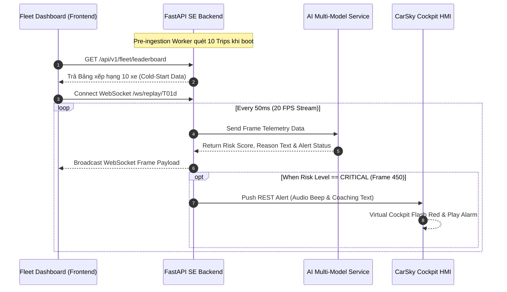

# 📑 SOFTWARE REQUIREMENTS SPECIFICATION (SRS)
## AI FLEET MANAGEMENT & DRIVER INTELLIGENCE PLATFORM (FPTU DMS)

> **Document Type:** Software Requirements Specification (SRS) & System Architecture Specification  
> **Version:** 4.0 (Final Release for SE & AI Team Co-development)  
> **Target Audience:** SE Engineers (Backend & Frontend) & AI Engineers (DMS, ADAS & Risk Fusion Models)  

---

## 1. 🌐 SYSTEM CONTEXT & OVERVIEW (TỔNG QUAN HỆ THỐNG)

Hệ thống **FPTU DMS** là nền tảng quản lý an toàn hạm đội xe thông minh thời gian thực. Hệ thống kết hợp giữa **Mạng lưới Mô hình AI (AI Multi-Model Pipeline)** và **Kiến trúc Hệ thống SE (Feature-Domain Modular Monolith & Fleet UI)**.

```mermaid
graph TD
    subgraph Edge Layer / Vehicle Unit
        Sensors[Webcam Feed & OBD-II Telemetry]
    end

    subgraph AI Pipeline Layer
        M1[Model 1: DMS Engine - EAR/MAR/Head Pose]
        M2[Model 2: ADAS Engine - TTC/Speed/Accel]
        M3[Model 3: Risk Fusion & GenAI Reasoning]
    end

    subgraph SE Backend Layer (FastAPI Core)
        Ingest[Pre-ingestion Worker]
        WS[WebSocket Stream 20 FPS Engine]
        Gateway[AI Gateway & REST API]
        Adapter[CarSky HMI Adapter]
    end

    subgraph SE Presentation Layer (Fleet UI)
        HUD[Driver HUD View]
        FleetMap[Fleet Leaderboard & GPS Live Map]
        Report[Business Donut & Radar Reports]
        Copilot[Interactive AI Copilot Chatbot]
    end

    subgraph External Systems
        CarSky[CarSky Workbench Virtual Cockpit]
        BTC[BTC Submission Exporter - 10 CSVs]
    end

    Sensors --> M1 & M2
    M1 & M2 --> M3
    M3 -->|JSON Payload| Gateway
    Gateway --> Ingest & WS & Adapter
    WS --> HUD & FleetMap
    Gateway --> Copilot & Report
    Adapter --> CarSky
    Ingest --> BTC
```

---

## 2. 📋 FUNCTIONAL REQUIREMENTS (YÊU CẦU CHỨC NĂNG)

| Requirement ID | Module / Component | Description (Mô tả Chức năng Kỹ thuật) | Đội ngũ Phụ trách |
| :--- | :--- | :--- | :--- |
| **FR-01** | **Live Alert & Reasoning** | AI tính toán `final_risk_score` (0-100) và sinh văn bản GenAI Reasoning. SE Backend broadcast qua WebSocket hiển thị banner nhấp nháy đỏ trên UI. | **AI:** Tính Risk & Text<br>**SE:** Alert Stream UI |
| **FR-02** | **20 FPS Temporal Replay** | Replay đồng bộ Video + Telemetry + ADAS HUD với tần số 20 FPS (50ms/frame). Cho phép tua Seek/Jump đến frame bất kỳ. | **AI:** Sinh dữ liệu frame<br>**SE:** WebSocket Engine & UI |
| **FR-03** | **TTC Assessment Engine** | Tính toán khoảng cách va chạm `predicted_ttc` ($s$). Khi `min_ttc < 1.5s`, hệ thống nổ còi 880Hz và đổi màu indicator nguy hiểm. | **AI:** Tính chỉ số TTC<br>**SE:** Gauge & Audio Synthesizer |
| **FR-04** | **Multi-Driver Comparison** | Cho phép chọn 2 tài xế trên UI để so sánh 5 chiều chỉ số (EAR, MAR, TTC, Speed, Harsh Brake) qua biểu đồ Radar Chart. | **AI:** Trích xuất chỉ số<br>**SE:** API Compare & Radar UI |
| **FR-05** | **Driver Safety Leaderboard** | Tự động tính điểm $\text{Safe Score} = 100 - \text{Max(Risk)}$ và xếp hạng 10 tài xế (`T01d`..`T10d`) từ Rank #1 (Safe) đến Rank #12 (Critical). | **AI:** Tính Risk score<br>**SE:** Pre-ingest Worker & UI |
| **FR-06** | **AI Copilot Chatbot** | Hỗ trợ hỏi đáp bằng Tiếng Việt tự nhiên (NL2Query) về tình trạng đội xe. Trả lời câu hỏi trong $\le 3$ giây kèm Action Buttons. | **AI:** LLM Agent Service<br>**SE:** Chat Widget & API |
| **FR-07** | **CarSky HMI Integration** | Push dữ liệu thời gian thực xuống CarSky Platform (`https://carsky.io`) qua REST/WebSocket để hiển thị trên Virtual Cockpit của tài xế. | **AI:** Output JSON Alert<br>**SE:** `carsky_adapter.py` |

---

## 3. ⚡ NON-FUNCTIONAL REQUIREMENTS (YÊU CẦU PHI CHỨC NĂNG)

1. **NFR-01 (Frequency & Latency):** Tần số Replay phát stream dữ liệu phải đạt chuẩn **20 FPS (50ms/frame)** với độ trễ truyền qua WebSocket $< 20\text{ms}$.
2. **NFR-02 (AI Copilot Response Time):** Thời gian phản hồi câu hỏi tiếng Việt của AI Copilot phải đạt $\le 3.0$ giây.
3. **NFR-03 (System Throughput):** Backend phải hỗ trợ duy trì đồng thời **10 luồng stream (10 Trips)** song song mà không giật lag CPU.
4. **NFR-04 (Offline Resilience / Fallback):** Khi mất kết nối internet hoặc mất API LLM, hệ thống tự chuyển sang **Fallback Rule Engine** để duy trì hoạt động cảnh báo.
5. **NFR-05 (Submission Compliance):** Xuất 10 file CSV kết quả khớp 100% định dạng BTC ($1800 \text{ frames} \times 5 \text{ cols}$, lỗi sai số $\text{MAE} < 1.5$).

---

## 4. 📄 DATA CONTRACT & JSON SCHEMAS (GIAO THỨC DỮ LIỆU SE - AI)

AI Multi-Model Engine và SE Backend giao tiếp thông qua **JSON Schema chuẩn hóa (Pydantic Models)**:

### 4.1 Frame Telemetry & Vision Input Schema (`telemetry.py` & `ai_vision.py`)
```json
{
  "frame_id": 450,
  "timestamp": 22.5,
  "telemetry": {
    "speed_kmh": 65.0,
    "longitudinal_accel": -2.8,
    "lateral_accel": 0.1,
    "latitude": 10.762622,
    "longitude": 106.660172,
    "heading_deg": 12.5
  },
  "ai_vision": {
    "ear_score": 0.15,
    "mar_score": 0.82,
    "head_pose_pitch": -15.2,
    "predicted_ttc": "1.2",
    "predicted_driver_state": "microsleep",
    "alertness_score": 0.15
  }
}
```

### 4.2 AI Risk Fusion Output Schema (`risk.py`)
```json
{
  "trip_id": "T01d",
  "frame_id": 450,
  "final_risk_score": 88.5,
  "risk_level": "CRITICAL",
  "shap_contribution": {
    "microsleep_ear": 0.45,
    "ttc_danger": 0.35,
    "harsh_brake": 0.20
  },
  "risk_reasoning_text": "Tài xế A phát hiện vi ngủ tại frame 450 (22.5s) kèm phanh gấp ở tốc độ 65km/h với khoảng cách va chạm TTC nguy kịch 1.2s.",
  "coaching_message": "Tài xế A (Xe VH-04) sụt giảm tỉnh táo xuống 15%. Vui lòng tắp xe vào lề dừng nghỉ!"
}
```

---

## 5. 🔌 INTERFACE SPECIFICATIONS (REST API & WEBSOCKET)

### 5.1 Real-time Replay WebSocket Endpoint
* **URI:** `ws://localhost:8000/ws/replay/{trip_id}`
* **Message Protocol:**
  * Client Seek Action: `{"action": "seek", "frame_id": 450}`
  * Server Broadcast Frame Payload (20 FPS).

### 5.2 Fleet Driver Leaderboard API
* **Endpoint:** `GET /api/v1/fleet/leaderboard`
* **Response Sample:**
```json
{
  "total_vehicles": 10,
  "rankings": [
    { "rank": 1, "vehicle_id": "VH-08", "trip_id": "T08d", "safe_score": 96.0, "status": "SAFE" },
    { "rank": 12, "vehicle_id": "VH-04", "trip_id": "T01d", "safe_score": 42.0, "status": "CRITICAL" }
  ]
}
```

### 5.3 AI Copilot Chat API
* **Endpoint:** `POST /api/v1/coaching/chat`
* **Request Payload:** `{"query": "Tài xế nào vi ngủ nhiều nhất hôm nay?"}`
* **Response Payload:**
```json
{
  "answer": "Tài xế A (Xe VH-04 / Chuyến T01d) phát hiện 2 khoảnh khắc vi ngủ tại frame 450 và frame 820.",
  "action_buttons": [
    { "label": "Gửi lịch nghỉ đề xuất", "action_id": "send_break_schedule" }
  ]
}
```

---

## 6. 📊 ARCHITECTURAL SEQUENCE DIAGRAM (SƠ ĐỒ TUẦN TỰ)



---

*Tài liệu SRS này là hợp đồng chuẩn hóa kỹ thuật chính thức giữa đội SE và đội AI phục vụ quá trình co-development.*
