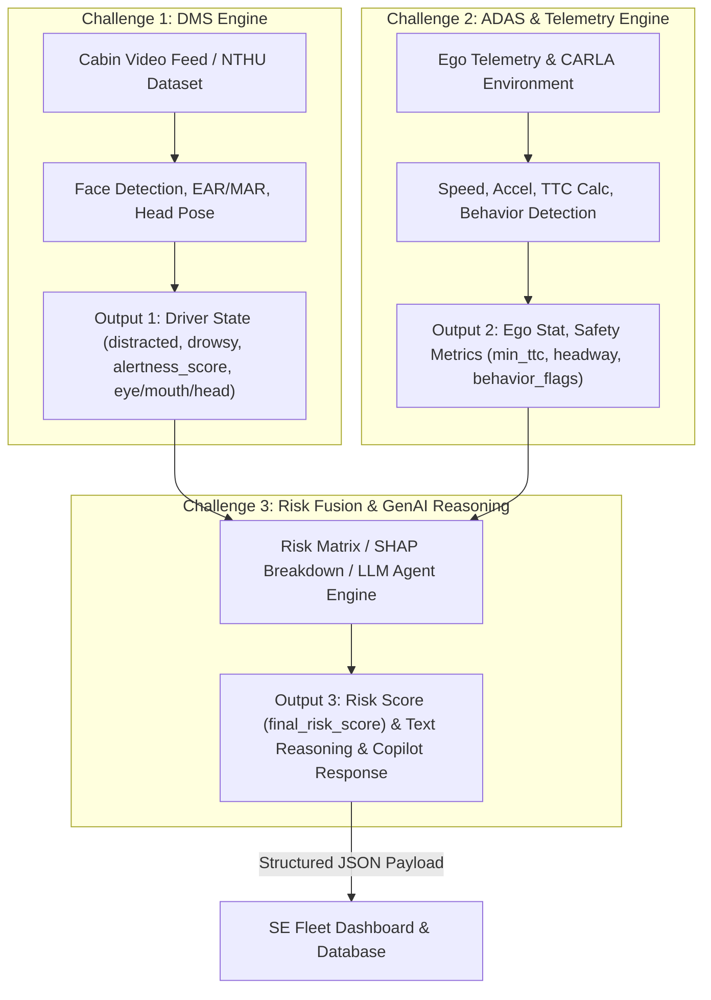
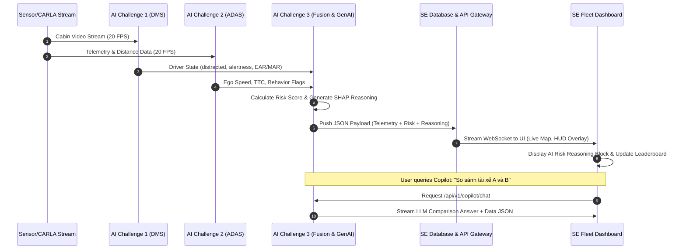

# TÀI LIỆU TỔNG QUAN HỢP NHẤT SE & AI: HỆ THỐNG GIÁM SÁT AN TOÀN & AI FLEET COPILOT

> **Dự án**: AI Fleet Management & Driver Intelligence Platform  
> **Phiên bản**: 3.1 (Chuẩn hóa 100% User Stories dành riêng cho Fleet Manager)  
> **Người lập**: SE Leader & AI Leader  
> **Mục tiêu**: Thống nhất luồng dữ liệu, chuẩn hóa User Stories theo góc nhìn Quản lý Đội xe (Fleet Manager), phân định công việc AI & SE, quy định chi tiết xử lý JSON payload và nêu bật giá trị Business/Management cho Doanh nghiệp.

---

## 1. VẤN ĐỀ GIẢI QUYẾT & BÀI TOÁN THỰC TẾ (PROBLEM STATEMENT)

### 1.1 Vấn đề của Quản lý Đội xe (Fleet Manager) & Doanh nghiệp
1. **Thiệt hại lớn từ Tai nạn Giao thông**: Các sự cố va chạm hàng năm gây tổn thất nặng nề về chi phí sửa chữa, bảo hiểm, downtime của xe và uy tín doanh nghiệp. Phần lớn nguyên nhân xuất phát từ yếu tố con người (mất tập trung, vi ngủ, bám đuôi quá sát, phanh gấp).
2. **"Bội bội" dữ liệu thô nhưng thiếu thông tin chi tiết (Data Rich, Insight Poor)**: Các thiết bị định vị GPS/Blackbox truyền thống chỉ trả về tốc độ và tọa độ. Quản lý đội xe không thể biết *tại sao* xe lại phanh gấp (do tài xế giật mình xem điện thoại hay do vật cản bất ngờ?), cũng không có thời gian ngồi soi hàng ngàn giờ video cabin.
3. **Phản ứng bị động (Reactive instead of Proactive)**: Chỉ xử lý sau khi tai nạn đã xảy ra. Thiếu cơ chế cảnh báo sớm, chấm điểm rủi ro tài xế theo thời gian thực và đào tạo lại (coaching) dựa trên bằng chứng khoa học.

### 1.2 Mục tiêu của Hệ thống
Tạo ra một **Hệ thống Quản lý An toàn Đội xe Thông minh (Business Intelligence & AI Copilot)** giúp Fleet Manager:
- Giám sát tình trạng xe & tài xế theo thời gian thực (20 FPS).
- Tự động hiểu và diễn giải **nguyên nhân rủi ro (AI Risk Reasoning)** thay vì chỉ đưa ra con số vô hồn.
- Tra cứu, so sánh hiệu suất lái xe và tư vấn vận hành bằng tiếng Việt tự nhiên thông qua **AI Fleet Copilot**.

---

## 2. GIÁ TRỊ KINH DOANH & QUẢN TRỊ (BUSINESS & MANAGEMENT VALUE)

Hệ thống Dashboard & AI Chatbot mang lại **giá trị kinh tế trực tiếp và hiệu quả quản trị vượt trội** cho Doanh nghiệp & Fleet Manager:

```
+-----------------------------------------------------------------------------------+
|                        GIÁ TRỊ DOANH NGHIỆP & GIÁM SÁT ĐỘI XE                      |
+---------------------------------------------------+-------------------------------+
| NÂNG CAO HIỆU QUẢ QUẢN TRỊ (FOR FLEET MANAGER)    | CẮT GIẢM CHI PHÍ (FOR BUSINESS)|
| 1. Giám sát thời gian thực & Cảnh báo tức thì     | 1. Giảm 15-30% Chi phí bảo hiểm|
| 2. Đào tạo tài xế dựa trên Bằng chứng (Evidence)  | 2. Giảm 10-15% Chi phí nhiên liệu|
| 3. Ra quyết định trong 3 giây nhờ AI Copilot      | 3. Tiết kiệm nhân sự vận hành |
+---------------------------------------------------+-------------------------------+
```

### 2.1 Đối với Fleet Manager (Người Quản lý Đội xe trực tiếp)
- **Tiết kiệm 90% Thời gian Giám sát**: Không cần mở hàng ngàn giờ video để tìm lỗi. AI tự động phát hiện, trích xuất sự cố và viết sẵn đoạn giải thích nguyên nhân (**Risk Reasoning**).
- **Ra quyết định tức thì dựa trên dữ liệu (Data-Driven Decision)**: Biết chính xác tài xế nào cần được nhắc nhở, tuyến đường nào hay xảy ra bám đuôi/phanh gấp để điều chỉnh ca trực.
- **Tương tác thông minh bằng Tiếng Việt (AI Copilot)**: Chỉ cần gõ hoặc nói *"Liệt kê tài xế vi ngủ nhiều nhất tuần qua"*, Copilot trả về danh sách kèm phân tích chi tiết trong 3 giây thay vì phải thao tác lọc báo cáo Excel phức tạp.
- **Đào tạo lại dựa trên Bằng chứng khoa học (Evidence-Based Coaching)**: Dùng dữ liệu TTC, SHAP breakdown và clip cắt sẵn để đối thoại với tài xế, loại bỏ việc tranh cãi do đánh giá cảm tính.

### 2.2 Đối với Doanh nghiệp Vận tải (Business Impact & ROI)
- **Cắt giảm 15 - 30% Chi phí Bảo hiểm & Bồi thường**: Minh chứng bằng dữ liệu giám sát TTC & an toàn chủ động giúp doanh nghiệp đàm phán mức phí bảo hiểm ưu đãi cao nhất.
- **Tiết kiệm 10 - 15% Chi phí Nhiên liệu & Sửa chữa Xe**: Phát hiện và hạn chế các hành vi phanh gấp (`harsh_brake`), tăng tốc đột ngột (`harsh_accel`), giúp kéo dài tuổi thọ lốp, phanh và động cơ.
- **Bảo vệ Uy tín Thương hiệu & Giảm Downtime**: Hạn chế tối đa tai nạn thảm khốc, đảm bảo hàng hóa/hành khách đến nơi đúng giờ, nâng cao uy tín cạnh tranh trên thị trường.
- **Tối ưu hóa Chi phí Vận hành (OpEx Efficiency)**: 1 Fleet Manager có thể quản lý hiệu quả quy mô đội xe gấp 3-5 lần so với trước đây nhờ sự trợ giúp của AI Copilot.

---

## 3. CHUẨN HÓA USER STORIES DÀNH RƯỜNG CHO FLEET MANAGER (USER STORIES TO FEATURE MATRIX)

Toàn bộ User Stories được chuẩn hóa 100% theo góc nhìn và nhu cầu thực tế của **Quản lý Đội xe (Fleet Manager)**:

| STT | User Story của Fleet Manager (Nhu cầu & Giá trị Quản trị) | Nỗi đau Quản lý gặp phải | Tính năng Hệ thống đáp ứng (Feature) | Đội ngũ phụ trách |
| :--- | :--- | :--- | :--- | :--- |
| **US-01** | **Là một Fleet Manager**, tôi muốn nhận cảnh báo thời gian thực kèm lời giải thích nguyên nhân (Reasoning) khi xe gặp nguy cơ tai nạn cao, **để** tôi hiểu ngay bản chất rủi ro (tài xế vi ngủ hay bị tạt đầu) và kịp thời gọi điện chỉ đạo can thiệp. | Nhận thông báo phanh gấp thô nhưng không biết tài xế có ngủ gật hay xem điện thoại không để xử lý. | **Live Critical Alert & AI Risk Reasoning Block**: Cảnh báo màu đỏ nổi bật kèm văn bản GenAI giải thích nguyên nhân. | **AI (Ch3)** sinh lời văn<br>**SE** làm UI Alert Stream |
| **US-02** | **Là một Fleet Manager**, tôi muốn xem lại video sự cố được tua sẵn đến đúng khoảnh khắc vi phạm có đồng bộ với vệt HUD và biểu đồ telemetry, **để** tôi kiểm tra diễn biến trong 10 giây mà không cần tốn thời gian xem lại toàn bộ video thô. | Xem lại video dài hàng tiếng đồng hồ rất tốn thời gian và không biết tương quan tốc độ/khoảng cách. | **Trip Incident Replay**: Trình phát Video đồng bộ ADAS HUD overlay + Telemetry Timeline (20 FPS). | **AI (Ch1, Ch2)** sinh Data<br>**SE** làm Video Sync Player |
| **US-03** | **Là một Fleet Manager**, tôi muốn theo dõi chỉ số TTC (Time-To-Collision) và Headway của từng tài xế, **để** chủ động phát hiện thói quen chạy bám sát nguy hiểm trước khi tai nạn va chạm thực sự xảy ra. | Không có công cụ đo lường khoảng cách va chạm thời gian thực, chỉ biết khi đã xảy ra đâm va. | **TTC Assessment Engine & Headway Gauge**: Đo lường, vẽ biểu đồ rủi ro va chạm và tô màu cảnh báo. | **AI (Ch2)** tính TTC<br>**SE** vẽ Chart & Indicator |
| **US-04** | **Là một Fleet Manager**, tôi muốn đặt 2 tài xế hoặc 2 chuyến đi cạnh nhau để so sánh các chỉ số an toàn, **để** đánh giá ai lái an toàn hơn và tìm ra tài xế nào hay vi phạm mất tập trung/phanh gấp trên cùng tuyến đường. | Báo cáo Excel thủ công không thể so sánh đa chiều các chỉ số sinh lý & hành vi lái xe. | **Driver & Trip Comparison Module**: Chọn Dropdown 2 tài xế, hiển thị Radar Chart & Bar Chart so sánh 5 chiều. | **AI (Ch3)** xuất tổng hợp<br>**SE** làm API & Visual UI |
| **US-05** | **Là một Fleet Manager**, tôi muốn có Bảng xếp hạng điểm an toàn (Fleet Driver Ranking / Leaderboard) xếp thứ tự tài xế theo điểm Safe Score / Risk Score theo ngày/tốc độ/số lần vi phạm, **để** tôi vinh danh tài xế xuất sắc và kịp thời cảnh báo/đào tạo lại (coaching) nhóm tài xế có rủi ro cao. | Đánh giá tài xế dựa trên cảm tính dẫn đến tranh cãi, thiếu bảng tổng sắp xếp hạng quy chuẩn giữa các tài xế trong đội xe. | **Fleet Driver Ranking & Safety Leaderboard Module**: Bảng xếp hạng trực quan Top Safe Drivers & Top At-Risk Drivers (Safety Score = 100 - Risk Score, phân loại thứ hạng Rank #1, #2, #3 kèm badge phân cấp nguy cơ). | **AI (Ch3)** tính toán điểm tổng hợp<br>**SE** làm Bảng Driver Ranking UI |
| **US-06** | **Là một Fleet Manager**, tôi muốn gõ câu hỏi bằng Tiếng Việt tự nhiên với AI Copilot (như *"Liệt kê tài xế vi ngủ nhiều nhất tuần qua"*), **để** nhận câu trả lời phân tích trong 3 giây mà không cần thao tác lọc filter phức tạp. | Tìm kiếm dữ liệu trong hệ thống rắc rối, tốn thời gian lập báo cáo định kỳ. | **AI Fleet Copilot (Chatbot & Command Bar)**: Trợ lý giao tiếp tự nhiên (NL2Query) & Tư vấn vận hành. | **AI (Ch3)** LLM Agent<br>**SE** làm Chat Widget UI |
| **US-07** | **Là một Fleet Manager**, tôi muốn theo dõi tổng hợp các cờ hành vi thô bạo (phanh gấp, tăng tốc đột ngột, quá tốc độ), **để** đưa ra biện pháp nhắc nhở giúp giảm chi phí nhiên liệu, bảo trì xe và đàm phán giảm phí bảo hiểm. | Chi phí vận hành, nhiên liệu và sửa chữa xe hàng tháng quá cao do thói quen lái xe thô bạo. | **Operational Behavior Analytics Dashboard**: Biểu đồ phân tích tần suất cờ lỗi & tác động chi phí. | **AI (Ch2, Ch3)** thống kê<br>**SE** làm Biểu đồ Analytics |

---

## 4. LUỒNG KỸ THUẬT CHI TIẾT CỦA CÁC AI CHALLENGES (INPUT $\rightarrow$ PROCESSING $\rightarrow$ OUTPUT)

Hệ thống AI được chia làm 3 Challenge độc lập nhưng nối tiếp nhau chặt chẽ theo dạng Pipeline:



### 4.1 Challenge 1: Driver Monitoring System (DMS)
- **Nhiệm vụ**: Theo dõi và phân tích trạng thái sinh lý & hành vi của tài xế qua camera cabin.
- **Input**: Luồng Video Camera Cabin (Hình ảnh khuôn mặt, ánh mắt, tư thế đầu, chuỗi frame 20 FPS từ NTHU Driver State Dataset).
- **Xử lý AI**: 
  - Trích xuất mốc khuôn mặt (Facial Landmarks).
  - Tính chỉ số chớp mắt/nhắm mắt (EAR - Eye Aspect Ratio), ngáp (MAR - Mouth Aspect Ratio).
  - Ước lượng hướng nhìn & tư thế đầu (Head Pose Estimation).
  - Nhận diện nhãn trạng thái: Normal, Distracted (quay đầu nhìn điện thoại/bên cạnh), Drowsy/Microsleep (nhắm mắt kéo dài).
- **Output truyền sang Challenge 3**:
  ```json
  "driver": {
    "state": "distracted",
    "alertness_score": 0.45,
    "eye_state": "open",
    "head_pose": "side",
    "mouth_state": "normal",
    "nthu_subject_id": "14"
  }
  ```

### 4.2 Challenge 2: Vehicle Telemetry & ADAS Risk Engine
- **Nhiệm vụ**: Phân tích động lực học của xe và tương quan khoảng cách với môi trường xung quanh.
- **Input**: Dữ liệu cảm biến xe thô (Tốc độ, Gia tốc 3 chiều, Tọa độ GPS, Khoảng cách xe phía trước từ CARLA Simulation / Camera hành trình ADAS).
- **Xử lý AI**:
  - Tính toán vận tốc ($km/h$), gia tốc dọc/ngang ($m/s^2$).
  - **Tính chỉ số va chạm TTC (Time-To-Collision)** và khoảng cách theo thời gian (Headway Second).
  - Nhận diện cờ hành vi lái xe nguy hiểm (Behavior Flags): Phanh gấp (`harsh_brake`), Tăng tốc đột ngột (`harsh_accel`), Cua gắt (`harsh_corner`), Vượt tốc độ tối đa (`speeding`), Bám đuôi sát (`tailgating`).
- **Output truyền sang Challenge 3 & SE**:
  ```json
  "ego": {
    "speed_kmh": 65.2,
    "longitudinal_accel": -4.2,
    "lateral_accel": 0.15,
    "geolocation": { "lat": -0.00123, "lon": -0.000485, "alt": 0.16 }
  },
  "safety_metrics": {
    "min_ttc": 1.42,
    "headway_sec": 0.85,
    "behavior_flags": {
      "harsh_brake": true,
      "harsh_accel": false,
      "harsh_corner": false,
      "speeding": false,
      "tailgating": true
    }
  }
  ```

### 4.3 Challenge 3: Risk Fusion Engine & GenAI Reasoning
- **Nhiệm vụ**: Tổng hợp dữ liệu từ Challenge 1 & Challenge 2 để tính điểm rủi ro tổng thể, trích xuất nguyên nhân (SHAP Breakdown) và sinh lời văn giải thích bằng GenAI / LLM.
- **Input**: Kết hợp Output Challenge 1 (Driver State) + Output Challenge 2 (Telemetry & TTC).
- **Xử lý AI**:
  - **Risk Fusion Engine**: Tính toán `base_risk` (từ TTC và hành vi xe) $\times$ `driver_factor` (từ mức độ mất tập trung/mệt mỏi của tài xế) $\rightarrow$ `final_risk_score` (thang điểm 0 - 100).
  - **SHAP Breakdown / Feature Attribution**: Xác định yếu tố nào đóng góp nhiều nhất vào điểm phạt rủi ro (Ví dụ: 60% do vi ngủ, 30% do bám đuôi, 10% do vượt tốc).
  - **GenAI / LLM Reasoning Generator**: Chuyển đổi các con số kỹ thuật thành đoạn văn tự nhiên (Tiếng Việt) dễ hiểu cho Fleet Manager.
  - **LLM Fleet Copilot Agent**: Đóng vai trò chatbot nhận câu hỏi của user, thực hiện NL2Query SQL/Database và trả về câu trả lời phân tích / tư vấn.

---

## 5. PHÂN TÍCH CHI TIẾT CÁCH SE XỬ LÝ GÓI JSON TỪ AI (KEY-BY-KEY SE PROCESSING MAPPING)

Dưới đây là bảng quy định **chi tiết từng trường dữ liệu (Field-by-Field)** trong gói JSON mà AI truyền về và **cách thức xử lý cụ thể của bên SE**:

```json
{
  "trip_id": "T01d",
  "metadata": { ... },
  "telemetry_frame": {
    "frame_id": 450,
    "timestamp": 22.5,
    "ego": { ... },
    "driver": { ... },
    "safety_metrics": { ... },
    "risk": { ... }
  },
  "ai_generated_reasoning": { ... }
}
```

### Bảng Mapping Xử lý Chi tiết của SE:

| Key trong JSON Payload | Dữ liệu từ AI | Cách SE xử lý & Hiển thị trên Dashboard | Mục đích UI / Operations của Fleet Manager |
| :--- | :--- | :--- | :--- |
| `trip_id` & `metadata` | Tên chuyến đi, thời lượng, bản đồ, tốc độ giới hạn (`speed_limit_kmh: 80`) | - Lưu DB làm Index.<br>- Hiển thị Header Card của Trip Detail View.<br>- Dùng `speed_limit_kmh` để vẽ đường tham chiếu đỏ trên Biểu đồ Tốc độ. | Manager nhận diện chuyến đi & thiết lập ngưỡng cảnh báo quá tốc độ. |
| `ego.speed_kmh` | Tốc độ xe thời gian thực (65.2 km/h) | - Render Đồng hồ kim/số (Gauge Speedometer).<br>- Vẽ đường Speed trên Telemetry Timeline.<br>- Nếu `speed > speed_limit`, highlight màu Đỏ. | Manager biết xe đang chạy với vận tốc bao nhiêu tại khoảnh khắc rủi ro. |
| `ego.longitudinal_accel` & `lateral_accel` | Gia tốc dọc (-4.2 $m/s^2$) & ngang (0.15 $m/s^2$) | - Render chỉ số $G$-Force Meter.<br>- Nhận diện mức độ phanh gấp ($<-3.0m/s^2$) để tạo marker giật cục trên Timeline. | Manager đo lường mức độ thô bạo khi tài xế đạp phanh/ga hoặc cua gắt. |
| `ego.geolocation` (`lat`, `lon`, `alt`) | Tọa độ GPS của xe (-0.00123, -0.000485) | - Cập nhật marker vị trí xe thời gian thực trên bản đồ GPS (Leaflet/Mapbox).<br>- Vẽ đường di chuyển (Polylines trajectory). | Manager biết chính xác xe đang bị sự cố ở vị trí địa lý nào (đoạn đèo, cao tốc). |
| `driver.state` & `alertness_score` | Trạng thái tài xế (`distracted`, score `0.45`) | - Hiển thị Badge trạng thái góc trên Video (Badge Vàng: Distracted, Badge Đỏ: Drowsy).<br>- Render thanh Alertness Score Gauge (0% - 100%). | Manager giám sát mức độ tỉnh táo & tập trung của tài xế cabin. |
| `driver.eye_state`, `head_pose`, `mouth_state` | Nhắm/mở mắt, nghiêng đầu, ngáp | - Hiển thị dạng Icon chi tiết dưới Video Player.<br>- Đồng bộ với vệt bounding box mặt tài xế trên Video. | Manager xem minh chứng chi tiết cho trạng thái mất tập trung (đang quay đầu hay nhắm mắt). |
| `driver.nthu_subject_id` | Mã định danh tài xế (Mã ID: 14) | - Map với bảng `Drivers` trong SE DB để lấy Tên, Ảnh đại diện, Đội xe.<br>- Dùng cho Bảng xếp hạng Leaderboard & Module So sánh. | Manager xác định chính xác tài xế chịu trách nhiệm cho chuyến đi. |
| `safety_metrics.min_ttc` | Thời gian va chạm tối thiểu (1.42s hoặc `Infinity`) | - Hiển thị đồng hồ đếm TTC.<br>- Nếu `min_ttc < 2.5s`: Cảnh báo Cam (Warning).<br>- Nếu `min_ttc < 1.5s`: Cảnh báo Đỏ (Critical Alert). | Manager nắm bắt chỉ số quan trọng nhất đánh giá khoảng cách an toàn. |
| `safety_metrics.headway_sec` | Khoảng cách theo xe (0.85s hoặc `Infinity`) | - Hiển thị chỉ số Headway Bar Indicator.<br>- Highlight đỏ nếu $<1.0s$. | Manager đánh giá thói quen chạy bám đuôi xe trước của tài xế. |
| `safety_metrics.behavior_flags` | Cờ hành vi: `harsh_brake`, `tailgating`,... | - Tạo các Event Badge (Tag cờ lỗi) đánh dấu trực tiếp lên thanh tua Video Timeline. | Manager click vào thanh tua để nhảy ngay đến đúng frame phạm lỗi. |
| `risk.base_risk` & `driver_factor` | Điểm rủi ro cơ bản & Hệ số tài xế thô từ AI | - Dùng cho tính toán và phân tích đa chiều SHAP Matrix. | Đánh giá mức độ đóng góp của tài xế vào nguy cơ tai nạn. |
| `risk.final_risk_score` | Điểm rủi ro tổng hợp (77.0 / 100) | - Tính **Safety Score = 100 - 77.0 = 23.0/100**.<br>- Tô màu đỏ nguy hiểm.<br>- Cập nhật điểm tích lũy vào Bảng xếp hạng Fleet Leaderboard. | Manager có con số tổng hợp quyết định chuyến đi an toàn hay rủi ro. |
| `ai_generated_reasoning.summary` | Lời văn GenAI giải thích nguyên nhân (**Do SE Backend tự động sinh từ dữ liệu thô**) | - **Render trực tiếp vào Khối "AI Risk Reasoning Card"** ở vị trí nổi bật nhất bên phải Video Player. | Manager **hiểu RÕ RÀNG nguyên nhân vì sao xe nguy hiểm** mà không cần tự suy đoán. |
| `ai_generated_reasoning.severity` | Mức độ nghiêm trọng (`CRITICAL`) | - Kích hoạt Pop-up Modal cảnh báo khẩn và phát âm thanh còi báo động trên màn hình Fleet Manager. | Manager bị thu hút sự chú ý ngay lập tức đối với các xe nguy kịch. |
| `ai_generated_reasoning.recommended_action` | Khuyến nghị hành động xử lý | - Render khối nút bấm hành động (Action Buttons): `[Gọi cho Tài xế]`, `[Nhắc dừng nghỉ]`, `[Gửi cảnh báo SMS]`. | Manager biết cách xử lý sự cố chuẩn hóa theo quy trình công ty. |

---

## 6. Ý NGHĨA CHỈ SỐ TTC (TIME-TO-COLLISION) VỚI FLEET MANAGER

TTC là khoảng thời gian tính bằng giây còn lại trước khi xe mình va chạm với xe phía trước nếu cả hai giữ nguyên vận tốc:

$$\text{TTC} = \frac{d_{\text{relative}}}{v_{\text{relative}}}$$

### 6.1 Vì sao Quản lý Đội xe quan tâm đến TTC?
1. **Chấm điểm rủi ro chính xác (Driver Risk Scoring)**: Tài xế thường xuyên có $TTC < 2.5s$ thể hiện thói quen bám đuôi nguy hiểm và phanh muộn. Đây là chỉ số phản ánh bản chất an toàn tốt hơn hẳn tốc độ đơn thuần.
2. **Kích hoạt hệ thống phòng ngừa tai nạn chủ động (ADAS FCW/AEB)**: 
   - $TTC < 2.5s$: Kích hoạt Cảnh báo va chạm phía trước (FCW - Forward Collision Warning).
   - $TTC < 1.5s$: Kích hoạt Phanh khẩn cấp tự động (AEB - Automatic Emergency Braking).
3. **Phân tích nguyên nhân sự cố (Post-Incident Analysis)**: Giúp làm rõ trách nhiệm khi va chạm xảy ra (tài xế không kịp quan sát hay do xe trước phanh gấp bất ngờ).
4. **Giảm 10 - 25% Chi phí Bảo hiểm**: Các công ty bảo hiểm ưu đãi mức phí đặc biệt cho đội xe chứng minh được có hệ thống theo dõi và kiểm soát ngưỡng an toàn TTC.
5. **Tối ưu lịch trình vận hành**: Nhận diện các đoạn đường hoặc khung giờ có mật độ TTC nguy hiểm cao để điều chỉnh tuyến đường.

### 6.2 Khi nào KHÔNG quá cần thiết?
- Đội xe nhỏ, di chuyển trong kho bãi nội bộ với vận tốc rất thấp (<15 km/h).
- Trường hợp này có thể thay thế bằng proxy đơn giản: Số lần phanh gấp, còi báo bám đuôi cơ bản.

---

## 7. KIẾN TRÚC BỐ CỤC DASHBOARD (3-TIER UI LAYOUT ARCHITECTURE & DRIVER RANKING)

Hệ thống Dashboard do SE thiết kế chia thành **3 Tầng** khoa học, tích hợp đầy đủ tính năng **Bảng xếp hạng Tài xế (Driver Ranking / Leaderboard)** từ ảnh UI Demo:

```
+-----------------------------------------------------------------------------------+
|                        HEADER BAR: Navigation & AI Command Bar                    |
+-----------------------------------------------------------------------------------+
| TẦNG 1: LIVE OVERVIEW & DRIVER RANKING | TẦNG 2: DETAILED ANALYTICS & REASONING   |
| - Bản đồ xe chạy (GPS Trajectory Map) | - Synchronized Dual Cam (Cabin & Road)    |
| - Driver Safety Ranking (Leaderboard)  | - Telemetry Timeline (Speed, Accel, TTC) |
| - Alert Notifications Feed (Risk Zone) | - AI Risk Reasoning Card & Radar Chart   |
+----------------------------------------+------------------------------------------+
| TẦNG 3: INTERACTIVE COPILOT (Floating Chat Engine & Natural Language Queries)     |
+-----------------------------------------------------------------------------------+
```

- **Tầng 1 - Live Overview & Driver Ranking (Tổng quan & Bảng xếp hạng)**: 
  - Bản đồ GPS thời gian thực (Active Fleet Status & Trajectory).
  - **Bảng xếp hạng Tài xế (Driver Safety Ranking Leaderboard)**: Xếp hạng danh sách tài xế theo điểm Safe Score (0 - 100), hiển thị phân cấp thứ hạng (Top Safe vs. High Risk Drivers), số lần vi phạm (vi ngủ/Microsleep, TTC phanh gấp) và nút tương tác trực tiếp `[Intervene / Can thiệp]` hoặc `[View Details]`.
  - Alert Feed nổi bật cho các xe nằm trong vùng rủi ro (Risk Zone).
- **Tầng 2 - Trip Detail & Performance Insights (Chi tiết Chuyến đi & So sánh)**:
  - *Trip Detail*: Camera đôi đồng bộ (Cabin + Front Road ADAS HUD) + Telemetry Sync Chart (Speed/Accel/TTC) + Khối văn bản **AI Risk Reasoning Card**.
  - *Performance Insights*: Biểu đồ tổng hợp lỗi vi phạm (Distracted, Speeding, Harsh Brake, Lane Departure) + **Telemetry Comparison (Radar Chart So sánh Tài xế A vs Tài xế B)**.
- **Tầng 3 - Interactive Copilot (Hỗ trợ Trợ lý AI)**: Chat Widget nổi góc dưới màn hình ("Fleet AI Copilot") cho phép gõ/hỏi bằng tiếng Việt (*"Tài xế nào đang có rủi ro cao nhất hôm nay?"*) và nhận phân tích + khuyến nghị hành động nhanh (`Gửi lịch nghỉ đề xuất`, `Xem full trip`).

---

## 8. QUY TRÌNH PHÓI HỢP & VERIFICATION ROADMAP (AI & SE WORKFLOW)



---
*Tài liệu được thống nhất và phê duyệt bởi SE Leader & AI Leader.*
