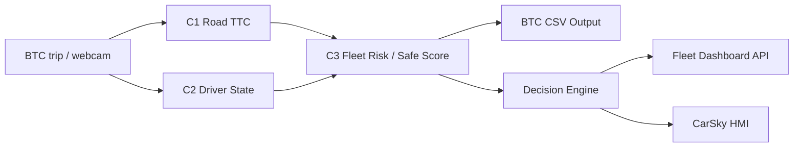

# 6.1 AI Pipeline & Model Output Contract

Tai lieu nay mo ta phan AI pipeline dang co trong repo tai thoi diem kiem tra. Muc tieu: lam ro raw BTC/live data di qua module nao, model/challenge nao tao output gi, CSV nop BTC co contract ra sao, va payload realtime sang Fleet Dashboard/CarSky gom truong nao.

Nguyen tac: khong ghi noi dung khong co bang chung trong repo. Metrics ben duoi lay tu artifact evaluation hien co, khong tu tinh lai.

## 1. End-to-end AI data flow



Batch flow de nop/evaluate BTC dung `AI/scripts/run_inference.py`. Demo realtime/dataset-fleet dung cac script demo nhung van dung chung core C1/C2/C3 va Decision Engine.

## 2. BTC CSV output contract

CSV cuoi cung co 5 cot theo thu tu:

```csv
frame_id,timestamp,predicted_ttc,predicted_driver_state,predicted_risk_score
```

| Cot | Kieu / mien gia tri | Nguon sinh ra trong AI | Evidence |
|---|---|---|---|
| `frame_id` | int, theo frame BTC | Dataset frame id | `AI/scripts/run_inference.py:34-40`, `191-199` |
| `timestamp` | seconds, format 3 decimals | Dataset timestamp | `AI/scripts/run_inference.py:191-199` |
| `predicted_ttc` | seconds hoac `inf` | Challenge 1 `RoadTTCPredictor` + `format_ttc` | `AI/scripts/run_inference.py:73-76`, `132-139`, `191-199` |
| `predicted_driver_state` | 1 trong 5 C2 labels | Challenge 2 `DriverStatePredictor` | `AI/scripts/run_inference.py:76`, `136-138`, `191-199` |
| `predicted_risk_score` | 0..100 running penalty/risk score | Challenge 3 `FleetSafeDrivingScorer` | `AI/scripts/run_inference.py:138-143`, `184-198` |

`AI/team_kit/evaluation.py` cung xac nhan CSV contract tren va dung cac cot nay de evaluate 3 challenge.

## 3. Challenge 1: Road TTC

Input chinh:

- BTC road camera/calibration/trip frames.
- Telemetry frame gom speed/acceleration tu dataset loader.

Runtime:

- `RoadTTCPredictor(dataset.load_calibration(), road_config)` duoc khoi tao trong `run_inference.py`.
- Output chinh la `predicted_ttc`.
- Neu predictor loi o mot frame, fallback ve `inf` va `road_quality_status = invalid`.

Evidence:

- Khoi tao predictor: `AI/scripts/run_inference.py:73-76`
- Fallback TTC loi: `AI/scripts/run_inference.py:132-135`
- CSV output: `AI/scripts/run_inference.py:191-199`

## 4. Challenge 2: Driver State

Valid labels:

| Label | Runtime meaning |
|---|---|
| `alert` | normal / no clear unsafe driver state |
| `drowsy` | sleepy / fatigue |
| `yawning` | yawning |
| `distracted` | attention away / side-looking |
| `microsleep` | short eye-closure/sleep episode |

Evidence labels: `AI/core/challenge2_driver/label_contract.py:1-7` va backend enum `SE/BE/app/domain/schemas/ai_contract.py:21-26`.

Production model hien tai:

| Artifact | Safe check result |
|---|---|
| `AI/models/candidate_013.joblib` | exists, `10,194,185` bytes, SHA256 `e5fb2ecf75aaf7b4428ed8fb8a778b3161d584727429e0b799ee4ac6adb0ec62` |
| `AI/models/driver_state_current.joblib` | byte-identical alias, cung size va SHA256 |
| `AI/configs/model_registry.yaml` | production C2 points to `models/candidate_013.joblib` |

Safety note: README nay khong deserialize `.joblib` vi joblib/pickle co the execute code khi load. Model metadata duoc ghi nhan tu README/config/code contract va file hash.

C2 model contract:

- Runtime validate artifact phai co architecture hop le.
- Voi `legacy_5class`, artifact phai co `model`, `feature_names` dung schema `feature_names()`, va `n_features_in_` khop so feature runtime.
- `model_classes` phai nam trong `FINAL_LABELS`.

Evidence: `AI/core/challenge2_driver/model_contract.py:25-76`.

## 5. Challenge 3: Fleet Risk / Safe Score

C3 trong repo la scorer tai dung cong thuc BTC theo tung frame:

```text
safe = 100 - (
  harsh_brake_count * 3
  + harsh_accel_count * 2
  + harsh_corner_count * 2
  + near_miss_count * 5
  + speeding_pct_time * 0.15
)
```

Runtime C3 nhan:

- `predicted_ttc` tu C1.
- `speed_kmh`, `longitudinal_accel`, `lateral_accel` tu telemetry.
- `speed_limit_kmh` tu metadata trip hoac override.

Thresholds/penalties trong code:

| Thanh phan | Gia tri |
|---|---:|
| harsh brake | accel < `-0.40g` |
| harsh accel | accel > `0.35g` |
| harsh corner | abs lateral accel > `0.30g` |
| near miss | finite TTC < `1.5s` |
| speeding tolerance | speed > limit + `5 km/h` |
| near miss penalty | `5` points |
| harsh brake penalty | `3` points |
| harsh accel/corner penalty | `2` points |
| speeding max penalty | `15` points |

Evidence: `AI/core/challenge3_fusion/risk_engine.py:1-35`, `47-118`.

Important evaluator note: trong `AI/team_kit/evaluation.py`, Challenge 3 phu thuoc lon vao TTC du doan cua C1 va trip facts; gia tri `predicted_risk_score` chu yeu gate viec co attempt C3 hay khong. Evidence: `AI/team_kit/evaluation.py:59-69`, `653-659`.

## 6. Decision Engine contract

Decision Engine khong phai output CSV BTC; no phuc vu demo/product realtime sau C3.

`DecisionSnapshot` la input dong bo theo timestamp, gom:

- trip/frame/time: `trip_id`, `frame_id`, `timestamp_ms`
- vehicle: speed, speed limit, longitudinal/lateral accel
- C1: `predicted_ttc_sec`, `ttc_confirmed`, `road_quality_status`
- C2: `driver_state`, `driver_confidence`, `alertness_score`, face/eye/window quality, PERCLOS/closure/off-road/yawn duration
- C3: `c3_risk_score`, `c3_safe_score`, penalty/count fields

Evidence: `AI/core/decision_engine/schemas.py:26-75`.

`DecisionEvent` output gom:

| Field | Role |
|---|---|
| `schema_version` | current `1.0` |
| `event_id`, `idempotency_key` | event identity and de-duplication |
| `trip_id`, `driver_id`, `frame_id`, `trip_timestamp_ms` | event location |
| `status` | `open`, `update`, `resolved` |
| `alert_type`, `severity`, `confidence` | alert class and confidence |
| `audiences` | `driver_display`, `fleet_dashboard` |
| `evidence` | snapshot/risk/driver evidence |
| `recommended_action` | proposed action |
| `model_versions` | model version references |

Evidence: `AI/core/decision_engine/schemas.py:104-136`.

Transport note: non-finite float nhu `inf` duoc doi thanh `null` de JSON-safe. Evidence: `AI/core/decision_engine/schemas.py:125-136`.

## 7. AI -> SE/Fleet Dashboard realtime contract

AI gui 2 nhom du lieu realtime chinh.

### 7.1 Decision event

Endpoint backend: `POST /api/v1/alerts`.

Backend schema `DecisionEventPayload` yeu cau:

- `schema_version`, `event_id`, `idempotency_key`
- `trip_id`, `driver_id`, `frame_id`, `trip_timestamp_ms`, `timestamp_utc`
- `status`, `alert_type`, `severity`, `confidence`
- `audiences`, `evidence`, `recommended_action`

Backend dung `Idempotency-Key` header de chong duplicate. Neu audience co `driver_display`, event duoc enqueue sang CarSky publisher.

Evidence:

- AI client send: `AI/integrations/se_client.py:65-79`
- Backend schema: `SE/BE/app/modules/ai_alerts/router.py:25-43`
- Store/broadcast/CarSky enqueue: `SE/BE/app/modules/ai_alerts/router.py:156-181`

### 7.2 Live snapshot

Endpoint backend nhan live snapshot va frame preview. Snapshot payload dung de dashboard hien thi realtime TTC/risk/driver state/telemetry.

Cac field chinh AI gui:

| Field | Source |
|---|---|
| `trip_id`, `frame_id`, `trip_timestamp_ms` | trip/frame runtime |
| `speed_kmh`, `speed_limit_kmh` | telemetry/metadata |
| `predicted_ttc_sec` | C1; `inf` duoc gui thanh `null` |
| `risk_score`, `safe_driving_score`, `penalty_points` | C3 |
| `driver_state`, `driver_confidence`, `alertness_score` | C2 |
| `eye_state`, `head_pose`, `mouth_state` | C2 derived states |
| `harsh_brake`, `harsh_accel`, `harsh_corner`, `speeding`, `tailgating` | C3/behavior flags |
| `near_miss_count`, `microsleep_count`, `speeding_pct_time`, `avg_headway_sec` | cumulative/summary evidence |

Evidence:

- AI mapping to snapshot payload: `AI/integrations/se_client.py:110-180`
- Backend snapshot schema: `SE/BE/app/modules/ai_alerts/router.py:45-66`
- Backend store/latest snapshot: `SE/BE/app/modules/ai_alerts/router.py:338-369`

## 8. AI -> CarSky HMI contract

CarSky mapper maps AI/Fleet telemetry into VHAL-style signal paths.

| Signal path | Data |
|---|---|
| `Vehicle.Driver.State` | driver state |
| `Vehicle.Driver.AlertnessScore` | alertness score |
| `Vehicle.Speed` | speed / multiplexed payload path |
| `Vehicle.SpeedLimit` | speed limit |
| `Vehicle.ADAS.MinTTC` | TTC |
| `Vehicle.ADAS.Headway` | headway |
| `Vehicle.ADAS.FinalRiskScore` | final risk score |
| `Vehicle.ADAS.CriticalAlert` | critical flag |
| `Vehicle.ADAS.DisplaySeverity` | safe/warning/critical/recovery |
| `Vehicle.ADAS.AlertReasonCode` | alert reason |
| `Vehicle.ADAS.RecommendedActionCode` | action code |
| `Vehicle.ADAS.EventTransition` | open/update/resolved transition |
| `Vehicle.ADAS.AIStatus` | AI online/offline/status |

Evidence: `SE/BE/app/integrations/carsky/mapper.py:32-45`.

Severity/action derivation:

- Critical if risk >= 75, TTC <= 1.5s, or driver state is `microsleep`.
- Warning if risk >= 40, TTC <= 3.0s, or driver state is `drowsy/yawning/distracted`.
- Recommended action examples: `BRAKE_SAFE`, `TAKE_BREAK`, `FOCUS_FORWARD`, `REDUCE_SPEED`.

Evidence: `SE/BE/app/integrations/carsky/mapper.py:237-252`.

## 9. Evaluation evidence hien co

Artifact: `AI/artifacts/predictions_6_samples/evaluation.json`.

| Challenge | Metric tong | Gia tri hien co |
|---|---|---:|
| C1 TTC | overall composite | `73.6 / 100` |
| C1 TTC | overall F1 | `0.731` |
| C1 TTC | overall MAE critical | `1.028s` |
| C2 Driver State | overall composite | `84.0 / 100` |
| C3 Safe Score | overall composite | `100.0 / 100` |

C2 per-trip tu cung artifact:

| Trip | Accuracy | Macro-F1 | Composite |
|---|---:|---:|---:|
| T01-Sample | 0.678 | 0.667 | 67.3 |
| T02-Sample | 0.997 | 0.998 | 99.7 |
| T03-Sample | 0.952 | 0.975 | 96.3 |
| T04-Sample | 0.573 | 0.513 | 54.3 |
| T05-Sample | 1.000 | 1.000 | 100.0 |
| T06-Sample | 0.828 | 0.895 | 86.2 |

C2 class-level artifact: `AI/artifacts/predictions/candidate013_pred/analysis/overall_class_metrics.csv`.

| Label | Precision | Recall/TPR | F1 | FAR/FPR | FNR/Miss |
|---|---:|---:|---:|---:|---:|
| alert | 0.613 | 0.357 | 0.451 | 0.045 | 0.643 |
| drowsy | 0.992 | 0.918 | 0.953 | 0.003 | 0.082 |
| yawning | 0.960 | 0.952 | 0.956 | 0.008 | 0.048 |
| distracted | 0.673 | 0.896 | 0.769 | 0.145 | 0.104 |
| microsleep | 0.958 | 1.000 | 0.979 | 0.009 | 0.000 |

## 10. Commands for demo/evaluate

Run from `HACKATHON/`.

Inference 6 sample trips:

```powershell
python AI\scripts\run_inference.py `
  --data-dir ..\Practice_Dataset `
  --samples-only `
  --driver-model AI\models\candidate_013.joblib `
  --out AI\artifacts\predictions_6_samples
```

Evaluate:

```powershell
python AI\team_kit\evaluation.py `
  --predictions AI\artifacts\predictions_6_samples `
  --data-dir ..\Practice_Dataset `
  --output AI\artifacts\predictions_6_samples\evaluation.json
```

End-to-end dataset-fleet demo:

```powershell
.\scripts\run_product_demo.ps1 `
  -Mode dataset-fleet `
  -DataDir ..\Practice_Dataset `
  -DriverModel AI\models\candidate_013.joblib `
  -OpenDashboard `
  -RequireCarSky
```

## 11. Evidence index

| Noi dung | Source |
|---|---|
| CSV field order | `AI/scripts/run_inference.py:34-40` |
| C1/C2/C3 runtime composition | `AI/scripts/run_inference.py:73-92`, `132-199` |
| CSV writer | `AI/scripts/run_inference.py:219-226` |
| Decision events option | `AI/scripts/run_inference.py:331-345` |
| C3 formula and thresholds | `AI/core/challenge3_fusion/risk_engine.py:1-35`, `47-118` |
| DecisionSnapshot schema | `AI/core/decision_engine/schemas.py:26-75` |
| DecisionEvent schema | `AI/core/decision_engine/schemas.py:104-136` |
| AI->SE DecisionEvent client | `AI/integrations/se_client.py:65-79` |
| AI->SE LiveSnapshot client | `AI/integrations/se_client.py:110-180` |
| SE DecisionEvent schema/store | `SE/BE/app/modules/ai_alerts/router.py:25-43`, `156-181` |
| SE LiveSnapshot schema/store | `SE/BE/app/modules/ai_alerts/router.py:45-66`, `338-369` |
| Backend AI trip/frame schema | `SE/BE/app/domain/schemas/ai_contract.py:21-32`, `54-75`, `97-132` |
| C2 labels | `AI/core/challenge2_driver/label_contract.py:1-59` |
| C2 model validation | `AI/core/challenge2_driver/model_contract.py:25-76`, `137-169` |
| CarSky signal map | `SE/BE/app/integrations/carsky/mapper.py:32-45`, `237-252` |
| Model registry | `AI/configs/model_registry.yaml` |
| Model file hash | `AI/models/candidate_013.joblib`, SHA256 recorded above |
| Evaluation metrics | `AI/artifacts/predictions_6_samples/evaluation.json` |
| C2 class metrics | `AI/artifacts/predictions/candidate013_pred/analysis/overall_class_metrics.csv` |

## 12. Known limitations / no-hallucination notes

- Tai lieu nay khong deserialize `.joblib`; chi ghi hash/size va code/config references de tranh rui ro pickle/joblib.
- C3 `100/100` trong evaluation hien co la ket qua cua artifact `evaluation.json`; khong khang dinh generalization tren dataset khac.
- Live CarSky behavior phu thuoc runtime deployment/API key/cloud availability; tai lieu nay chi mo ta mapper va contract co trong repo.
- Neu thay model C2 khac `candidate_013.joblib`, phai chay lai preflight/inference/evaluation va cap nhat metrics.
